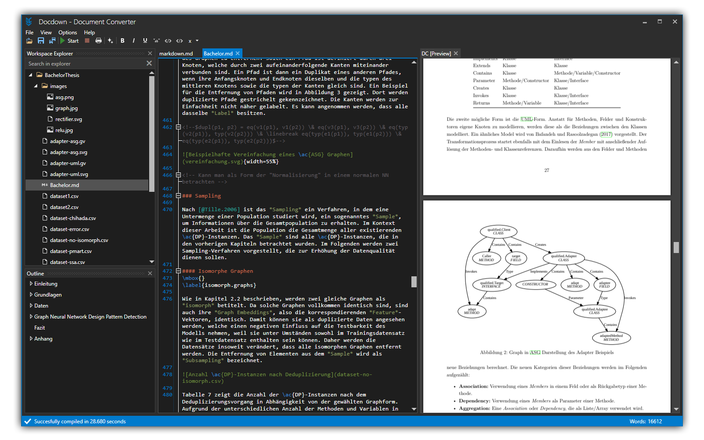

# Docdown

Docdown is a tool for creating PDF files from [markdown](#Markdown). It was made specifically to simplify the process of creating a scientific work by combining features of common TeX editors and Microsoft Word.

## Download

You can find the newest release [here](https://github.com/Darkgaja/Docdown/releases/latest). Docdown will automatically update itself on startup. Also, you can select `Check for updates` in the `Help` menu to find updates during runtime.

## Usage

After starting Docdown it will prompt you to select a workspace. Simply select a folder in your file system you want to work in. Docdown will automatically import all existing files into its workspace.

Alternatively select a file and direct windows to start it with Docdown. This will automatically open the file and set its parent directory as the used workspace.

### Compilation

Markdown files can be compiled to a PDF file via the `Start` button at the top of the application. Doing so will start the compilation process which previews the compiled PDF on the right side of your editor. Usually compilation takes 5-15 seconds, depending on the template, the size of your workspace and the amount of text to compile. Compilation takes all markdown files into account. They will be combined in alphabetical order. If you are using multiple markdown files it is recommended to prefix them (like `01`, `02`, `03`...). The shortcut for compilation is `F5`.

If the compilation of your workspace fails for some reason, it will display a message at the bottom of the application. An additional link will show you the output of the compiler to figure out the problem.

### Workspace

The workspace contains all files included in the compilation process. You additionally have the option to exclude certain files and folders from compilation. Doing so will also exclude all their children. 

Adding a new file/folder to the workspace can be done in different ways. Most easily a file can simply be placed in the folder currently used as the workspace. After a short duration the file will appear in Docdown. Furthermore, the file can be dragged directly into the workspace explorer. This will automatically add all selected files to the workspace. Finally one can right click a folder in the workspace explorer and create a new file/folder or import an existing file. Creating a new file opens a window in which you can select the file template.

### Editor

Docdown contains special editors for [markdown](#Markdown) (`.md`) and bibliography (`.bib`) files. These support auto completion, hovering, syntax highlighting, validation and much more. Futhermore in the top bar you can select commands that are executed on the current selected text in your editor. Using a command twice usually reverts the changes. These include:

* `Bold` makes the selected text appear bold.
* `Italic` makes the selected text appear italic.
* `Quote` indents the selected paragraphs.
* `Comment` excludes the selected paragraphs from compilation.
* `Verbatim` makes the selected text appear code-like.
* `List` contains multiple types of lists. Each paragraph appears as one item of that list.

For a list of available shortcuts refer [here](#Shortcuts).

### Settings

In the `Options` menu you can different means to customize your experience. Most notably, selecting `Settings` will open the settings window in which the used compilation server, the template and citation style can be changed. To connect to a server simply enter its domain name or IP address into the text box and press the button on the right hand side. Hovering over the button will also show the server latency. Changing the template or citation style is trivial.

Furthermore you can change the Language. Currently supported languages: `English`, `German` (partially)

Docdown also supports a day/night mode.

### Outline

When working on a markdown file, the outline will show all headings in a tree view. Double clicking an item in the outline will make the editor jump to the specified heading.

### Markdown

You can find the pandoc markdown documentation [here](https://pandoc.org/MANUAL.html#pandocs-markdown). As LaTeX is used for PDF creation, TeX commands can be used in the markdown file.

Furthermore the pandoc markdown standard has been enhanced by an inline CSV table macro. It works just as the image macro: ``. Docdown will automatically convert the CSV file to a markdown table.

### Shortcuts

* `F5` starts the compilation.
* `Ctrl+S` saves the current file.
* `Ctrl+F` shows the search bar and fills it with the selected text of the editor.
* `Ctrl+Space` shows the auto completion window. (if available)

## Contributing

All contributions are welcome. If you fix a bug or add a feature, a pull request would be great. 

Issues for new features or found bugs are also really appreciated.

## Roadmap

- Tasks and Errors view
- A better option menu
- Online workspace support
